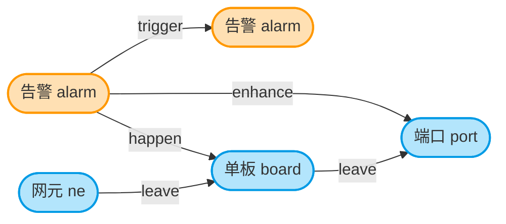

# 告警设备拓扑关系模型

## 流程图总览



**图例说明**:
- 🟧 橙色节点 = 告警(alarm)
- 🟦 蓝色节点 = 设备(ne / board / port)

## 一、节点(Node)类型

| 节点类型 | 说明 |
|---------|------|
| **alarm** | 告警节点 |
| **ne** | 网元(顶层设备) |
| **board** | 单板(中间层设备) |
| **port** | 端口(底层设备) |

## 二、边(Edge)类型

| 边类型 | 连接对象 | 含义 |
|--------|---------|------|
| **trigger** | alarm → alarm | 告警之间的触发/衍生关系 |
| **link** | 设备 ↔ 设备 | 设备间同层级连接关系 |
| **leave** | 设备 → 设备 | 设备间父子从属关系(ne→board→port) |
| **happen** | alarm → 设备 | 告警直接发生在该设备上(直接故障设备) |
| **enhance** | alarm → 设备 | 告警发生在该设备的子设备上(告警间接关联到父设备) |

## 三、设备层级(父子关系)

```
ne(网元)
 └── leave ── board(单板)
                └── leave ── port(端口)
```

设备间同时存在两种边:
- **link**:横向同层级连接(如两个端口之间的链路)
- **leave**:纵向父子从属(如单板属于某网元)

## 四、告警与设备的关联逻辑(核心)

```
                    ┌── happen ──→ 直接故障设备
    alarm(告警) ───┤
                    └── enhance ──→ 直接故障设备对应的子设备
```

**说明**:
- `happen`:告警指向**直接故障设备**(最精确的故障源)
- `enhance`:告警指向**直接故障设备对应的子设备**(通过父设备关联到子设备)

## 五、举例说明

假设告警 A 发生在单板 B1 上,而单板 B1 从属于网元 NE1,单板 B1 下有端口 P1:

```
alarmA ──happen──→ boardB1        (直接故障设备)
alarmA ──enhance──→ portP1         (故障设备对应的子设备:端口)

neNE1 ──leave──→ boardB1 ──leave──→ portP1   (设备父子层级)
portP1 ──link───→ portP2          (设备间链路连接)

alarmA ──trigger──→ alarmA2       (告警衍生)
```

## 六、故障组(Fault Group)识别

当多个告警和设备形成特定的拓扑模式时，会被识别为**故障组**，用于表示这些告警可能是同一故障源引起或相互关联。

### 6.1 故障组类型概述

| 故障组类型 | 条件 | 涉及节点 | 特征 |
|-----------|------|---------|------|
| **单网元多告警** | 同一网元有 ≥2 个告警 | 1 个网元 + ≥2 个告警 | 同设备故障 |
| **U型网元** | 2 个网元各有 1 个告警，且网元间有 link 连接 | 2 个网元 + 2 个告警 | 跨设备关联 |
| **C型网元** | 3 个网元链式相连，首尾网元各有 1 个告警 | 3 个网元 + 2 个告警 | 链路故障传播 |

### 6.2 单网元多告警故障组

**识别规则**：
1. 遍历所有 `happen` 边，找到告警直接关联的设备
2. 追溯该设备到其所属的网元（通过 `leave` 边）
3. 统计每个网元上的告警数量
4. 如果数量 **≥ 2**，则该网元形成故障组

```
    告警A        告警B
      |           |
    happen      happen
      |           |
    端口1        端口2
      |           |
    leave        leave
       \         /
        网元NE1
```

**可视化**：
- 用 **橙色椭圆包围圈** 包裹涉及的告警
- 告警之间自动生成 **trigger 边**（金黄色）表示关联

### 6.3 U型网元故障组

**识别规则**：
1. 存在 **2 个网元**
2. 每个网元上有 **1 个告警**（通过 `happen` 关联）
3. 两个网元之间有 **link 连接**（网元直接相连或通过端口相连）
4. 满足以上条件形成 U 型网元故障组

```
        告警A         告警B
          |           |
        happen      happen
          |           |
    核心路由器R1 === 汇聚交换机S1
         (link 直接连接)
```

**简化版（网元直接 link）**：
```
        告警A         告警B
          \           /
          happen    happen
            \       /
         核心路由器R1 --- 汇聚交换机S1
                (link)
```

**可视化**：
- 用 **橙色椭圆包围圈** 包裹两个告警
- 两个告警之间自动生成 **trigger 边**（金黄色）

### 6.4 C型网元故障组

**识别规则**：
1. 存在 **至少 3 个网元** 链式相连（A-B-C）
2. 首尾网元（A 和 C）之间有 **link 路径连接**
3. 首尾网元上各有 **1 个告警**（通过 `happen` 关联）
4. 满足以上条件形成 C 型网元故障组

```
        告警A                         告警B
          |                           |
        happen                      happen
          |                           |
    核心路由器R1 ← link → 汇聚交换机S1 ← link → 边缘路由器R2
```

**可视化**：
- 用 **青色椭圆包围圈** 包裹首尾两个告警
- 两个告警之间自动生成 **trigger 边**（金黄色）

### 6.5 故障组与 trigger 边的关系

当检测到故障组时，涉及的告警之间会自动生成 `trigger` 边，表示这些告警存在关联关系：

```javascript
// 故障组告警间 trigger 边生成
// 如果出现故障组，则涉及到的告警之间使用 trigger 连接
faultGroups.forEach(group => {
    const alarms = group.alarms;
    // 为告警之间两两添加 trigger 边
    for (let i = 0; i < alarms.length; i++) {
        for (let j = i + 1; j < alarms.length; j++) {
            // 检查是否已存在该边
            const exists = graphData.edges.some(
                e => e.source === alarms[i] && e.target === alarms[j] && e.type === 'trigger'
            );
            if (!exists) {
                graphData.edges.push({
                    source: alarms[i],
                    target: alarms[j],
                    type: 'trigger'
                });
            }
        }
    }
});
```

### 6.6 故障组可视化颜色

| 元素 | 颜色 | 说明 |
|------|------|------|
| 故障组包围圈（单网元/U型） | `#ff6600` 橙色 | 包裹涉及的告警 |
| 故障组包围圈（C型） | `#00c8c8` 青色 | 包裹首尾告警 |
| trigger 边 | `#ffc107` 金黄色 | 故障组告警间的关联 |

## 七、一句话总结

> 系统由**告警节点**和**设备节点(ne/board/port)**组成。设备间用 `link` 表示连接、`leave` 表示父子从属;告警间用 `trigger` 表示衍生传播;告警与设备间用 `happen` 定位**直接故障源**,用 `enhance` 关联**直接故障设备对应的子设备**。当多个告警形成特定拓扑模式时（单网元多告警、U型网元、C型网元），会自动识别为**故障组**，用包围圈标记并生成告警间的 trigger 关联。
